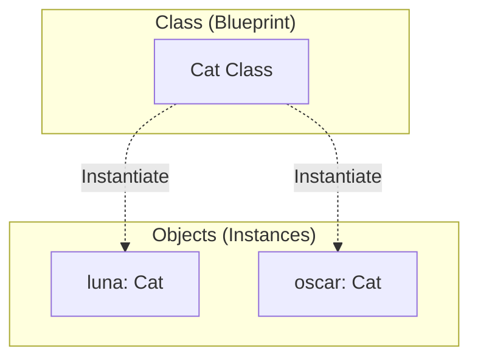
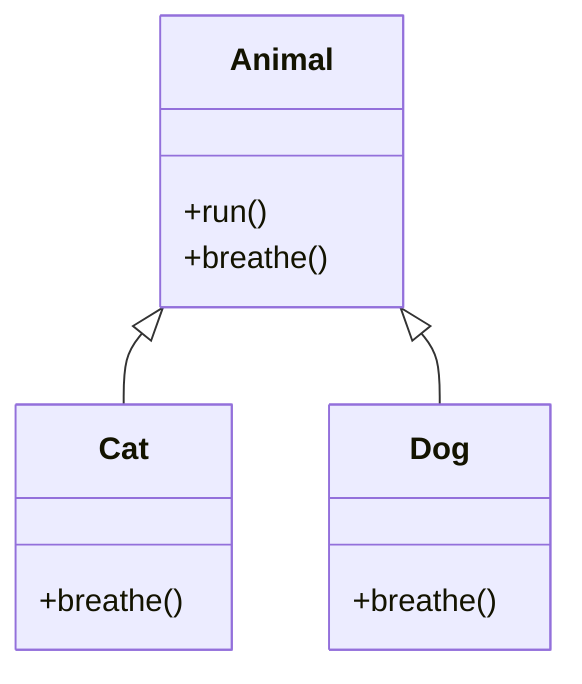
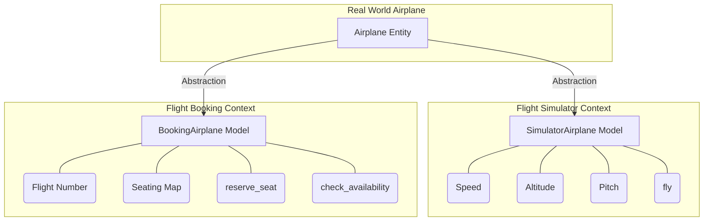
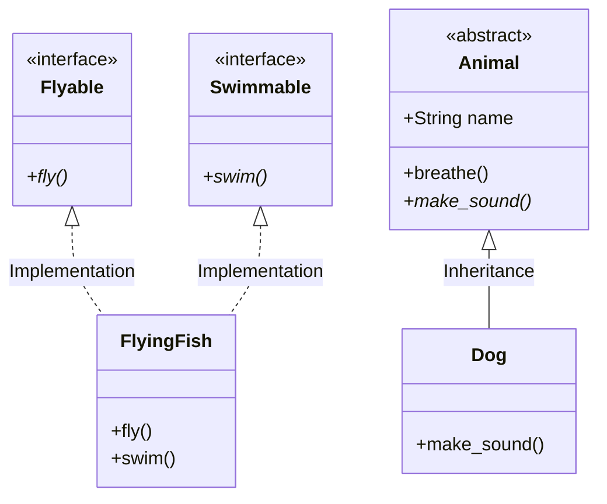

# คู่มือการเรียนรู้ Object-Oriented Programming (OOP) ด้วย Python

ยินดีต้อนรับสู่โปรเจกต์สำหรับผู้เริ่มต้นศึกษาแนวคิดการเขียนโปรแกรมเชิงวัตถุ (OOP) และหลักการ SOLID ผ่านภาษา Python ในโปรเจกต์นี้จะรวบรวมตัวอย่างโค้ดที่แบ่งตามหัวข้อพื้นฐานไปจนถึงระดับที่สูงขึ้น เพื่อให้เข้าใจง่ายและนำไปประยุกต์ใช้ได้จริง

---

## 📘 บทนำเกี่ยวกับ OOP (Introduction to OOP)
ในบริบทที่กว้างขึ้นของหนังสือ **Dive Into Design Patterns** บทนำนี้มีหน้าที่เป็นส่วนปูพื้นฐานเตรียมความพร้อม โดยมีประเด็นสำคัญดังนี้:

*   **การทบทวนความจำก่อนเริ่มศึกษา:** บทนำนี้มีไว้เพื่อให้ผู้อ่านได้ทบทวนความจำเกี่ยวกับคำศัพท์และแนวคิดหลักของการเขียนโปรแกรมเชิงวัตถุ (Object-Oriented Programming) ก่อนที่จะก้าวไปสู่การศึกษาดีไซน์แพตเทิร์นที่ซับซ้อนขึ้น หากผู้อ่านมีความเข้าใจในเรื่องเหล่านี้ดีอยู่แล้ว ก็สามารถข้ามไปอ่านในส่วนของแพตเทิร์นได้เลยทันที
*   **การปูพื้นฐานการอ่านแผนภาพ UML:** นอกเหนือจากทฤษฎีแล้ว บทนำนี้ยัง**อธิบายพื้นฐานของการอ่านแผนภาพ UML** (UML diagrams) ซึ่งมีความสำคัญอย่างยิ่งยวด เนื่องจากหนังสือเล่มนี้ใช้แผนภาพ UML จำนวนมหาศาลในการอธิบายโครงสร้างและความสัมพันธ์ของแพตเทิร์นต่างๆ
*   **รากฐานของการออกแบบเชิงวัตถุ:** เนื่องจากดีไซน์แพตเทิร์นคือแนวทางแก้ไขปัญหาทั่วไปที่เกิดขึ้นซ้ำๆ ใน**การออกแบบเชิงวัตถุ (Object-oriented design)** ความเข้าใจอย่างถ่องแท้ในหลักการ OOP จึงเป็นสิ่งจำเป็น โดยเนื้อหาได้ปูความเข้าใจผ่าน 3 ส่วนหลัก ได้แก่:
    *   **พื้นฐานของ OOP (Basics of OOP):** จุดเริ่มต้นสำคัญที่ปูความเข้าใจเกี่ยวกับ:
        *   **แนวคิด Objects:** การรวม **ข้อมูล (Data)** และ **พฤติกรรม (Behavior)** เข้าไว้ด้วยกัน
        *   **คลาสและวัตถุ:** ความสัมพันธ์ระหว่าง **"พิมพ์เขียว" (Class)** และ **"อินสแตนซ์ที่เป็นรูปธรรม" (Object)**
        *   **องค์ประกอบของคลาส:** การเก็บ **สถานะ (State)** ผ่านฟิลด์ และการกำหนด **พฤติกรรม (Behavior)** ผ่านเมธอด
        *   **ลำดับชั้นของคลาส (Class Hierarchies):** การจัดระเบียบผ่านคลาสแม่ (Superclass) และคลาสลูก (Subclass) รวมถึงการรับสืบทอดและการแทนที่ (Override) พฤติกรรม

        **ตัวอย่างพื้นฐาน (UML & Code):**
        ```mermaid
        classDiagram
            class Animal {
                +String name
                +String gender
                +int age
                +run()
                +breathe()
            }
            class Cat {
                +breathe()
            }
            Animal <|-- Cat : Inheritance
        ```
        ```python
        # จาก animal.py: คลาสแม่ (Superclass) และคลาสลูก (Subclass)
        class Animal:
            def __init__(self, name, gender, age):
                self.name = name  # State
                self.gender = gender
                self.age = age

            def breathe(self):  # Behavior
                print(f"{self.name} is breathing")

        class Cat(Animal):
            def breathe(self):  # Method Overriding
                print(f"{self.name} says: Meow!")
        ```
    *   **เสาหลักของ OOP (Pillars of OOP):** อธิบายแนวคิดสำคัญ 4 ประการ ได้แก่ **การนามธรรม (Abstraction), การห่อหุ้ม (Encapsulation), การสืบทอด (Inheritance) และพหุสัณฐาน (Polymorphism)** 
    *   **ความสัมพันธ์ระหว่างวัตถุ (Relations Between Objects):** อธิบายระดับความสัมพันธ์ของวัตถุและคลาส ตั้งแต่ความพึ่งพา (Dependency), ความเชื่อมโยง (Association), การรวมกลุ่ม (Aggregation), และองค์ประกอบ (Composition) 

การทำความเข้าใจเรื่อง **"ความสัมพันธ์ระหว่างวัตถุ"** ในบทนำนี้ จะถูกนำไปต่อยอดอย่างมากในส่วนของหลักการออกแบบซอฟต์แวร์ (Software Design Principles) โดยเฉพาะหลักการที่เน้นย้ำว่า **"ควรเลือกใช้องค์ประกอบ (Composition) มากกว่าการสืบทอด (Inheritance)"** ซึ่งเป็นโครงสร้างหัวใจหลักที่แพตเทิร์นส่วนใหญ่นำมาใช้แก้ปัญหาความซ้ำซ้อนและเพิ่มความยืดหยุ่นให้โปรแกรม

กล่าวโดยสรุป บทนำเกี่ยวกับ OOP เป็นการ**เตรียมเครื่องมือและภาษาสากล** (ทั้งแนวคิดและแผนภาพ) เพื่อให้ผู้อ่านมีความพร้อมที่จะทำความเข้าใจกลไกภายในของแพตเทิร์นต่างๆ ได้อย่างมีประสิทธิภาพสูงสุด

---

## 📂 โครงสร้างโปรเจกต์

โปรเจกต์นี้แบ่งไฟล์ตามแนวคิดหลักของ OOP ดังนี้:

1.  **`cat.py`**: พื้นฐาน Class และ Instance (วัตถุ)
2.  **`animal.py`**: การสืบทอด (Inheritance) และการเขียนทับเมธอด (Method Overriding)
3.  **`abstraction.py`**: การทำ Abstraction (คลาสโครงร่าง) โดยใช้ `ABC`
4.  **`encapsulate.py`**: การปกป้องข้อมูล (Encapsulation) และ Getter/Setter
5.  **`polymorphism.py`**: การพหุสัณฐาน (Polymorphism) และการ Override
6.  **[relationship/README.md](relationship/README.md)**: ความสัมพันธ์ระหว่างวัตถุ (Object Relationships) - เรียนรู้ Dependency, Association, Aggregation, Composition, Implementation, Inheritance และ **Runtime Flexibility vs Class Explosion** (ดูเพิ่มใน `aggregation_vs_composition.py` และ `composition_vs_inheritance.py`)
7.  **[solid/principle.py](solid/principle.py)**: หลักการออกแบบซอฟต์แวร์ที่ดี (SOLID Principles) ([อ่านรายละเอียดเพิ่มเติมในไดเรกทอรี](solid/README.md))
8.  **[solid/notification_case.py](solid/notification_case.py)**: Case Study ระบบแจ้งเตือน (Practical Application of SOLID)
9.  **[solid/payment_case.py](solid/payment_case.py)**: Case Study ระบบชำระเงิน (Strategy Pattern & OCP)
10. **[solid/exercises/](solid/exercises/)**: แบบฝึกหัดทบทวนความเข้าใจเรื่อง SOLID Principles ✍️
11. **`abstraction_compare.py`**: การเปรียบเทียบ Interface vs Abstract Class ⚖️

---

## 🔍 รายละเอียดในแต่ละบทเรียน

### 1. พื้นฐาน Class และ Instance (`cat.py`)
ไฟล์นี้แสดงจุดเริ่มต้นของกระบวนทัศน์ OOP:
- **Class**: **"พิมพ์เขียว" (Blueprints)** หรือแบบแปลนที่โปรแกรมเมอร์กำหนดขึ้น (เช่น คลาส `Cat`)
- **Instance (Object)**: **"อินสแตนซ์ที่เป็นรูปธรรม"** ที่สร้างขึ้นตามโครงสร้างของคลาส (เช่น `luna` และ `oscar`)
- **Fields (State)**: แอตทริบิวต์ที่เก็บข้อมูลหรือ **"สถานะ"** ของวัตถุ
- **Methods (Behavior)**: การทำงานที่กำหนด **"พฤติกรรม"** ของวัตถุ
- **`__init__`**: ฟังก์ชันพิเศษที่ใช้กำหนดค่าเริ่มต้นให้กับวัตถุ

**แผนภาพ UML (Class vs Object):**


```python
# ตัวอย่างการสร้าง Object จาก Class
class Cat: # คลาส Cat
    name: str # field ชื่อ เพื่อสำหรับการระบุชื่อของแมว
    gender: int = 0 # field เพศ เพื่อสำหรับการระบุเพศของแมว (0 = ไม่ระบุ, 1 = ผู้ชาย, 2 = ผู้หญิง)
    age: int = 0 # field อายุ เพื่อสำหรับการระบุอายุของแมว
    def __init__(self, name: str, gender: str, age: int): # constructor เพื่อสำหรับการสร้างวัตถุแมวใหม่
        self.name = name # กำหนดค่าให้กับ field ชื่อของแมว
        self.gender = gender # กำหนดค่าให้กับ field เพศของแมว
        self.age = age # กำหนดค่าให้กับ field อายุของแมว

if __name__ == '__main__':
    # สร้าง Instance (วัตถุ) จากคลาส Cat
    luna = Cat("Luna", "Female", 2) # สร้างวัตถุ (Instance)แมวชื่อ Luna ที่เป็นเพศหญิงและอายุ 2 ปี
    oscar = Cat("Oscar", "Male", 3) # สร้างวัตถุ (Instance) แมวชื่อ Oscar ที่เป็นเพศชายและอายุ 3 ปี

    print(f"Cat 1: {luna.name}, Gender: {luna.gender}, Age: {luna.age}")
    print(f"Cat 2: {oscar.name}, Gender: {oscar.gender}, Age: {oscar.age}")
```

### 2. การสืบทอดและการทำงานร่วมกัน (`animal.py`)
เรียนรู้วิธีการจัดระเบียบผ่าน **ลำดับชั้นของคลาส (Class Hierarchies)**:
- **Superclass (คลาสแม่)**: คลาสพื้นฐานที่รวบรวมสถานะและพฤติกรรมร่วม (เช่น `Animal`)
- **Subclass (คลาสลูก)**: คลาสที่แตกแขนงออกมาเพื่อรับสืบทอด (Inheritance) และกำหนดคุณสมบัติเฉพาะเพิ่มเติม
- **Method Overriding**: การ **"แทนที่"** พฤติกรรมของเมธอดที่สืบทอดมา เพื่อเปลี่ยนการทำงานให้เป็นแบบเฉพาะของตนเอง หรือเสริมการทำงานพิเศษเข้าไป

**แผนภาพ UML (Inheritance Hierarchy):**


```python
# ตัวอย่างการ Override เมธอด
class Cat(Animal):
    def breathe(self):
        # เปลี่ยนการทำงานของคลาสแม่ (Override)
        print(f"{self.name} says: Meow!")
```

### 3. การนามธรรม (`abstraction.py`)
**Abstraction** ช่วยลดความซับซ้อนในการออกแบบโปรแกรมโดย**การสร้างแบบจำลอง (Model) ของวัตถุหรือปรากฏการณ์ในโลกความเป็นจริง โดยจำกัดขอบเขตให้อยู่แค่ใน "บริบทที่เฉพาะเจาะจง" เท่านั้น**

ในการสร้างโปรแกรมด้วย OOP แม้ว่าเราจะสร้างอ็อบเจกต์โดยอิงจากสิ่งที่มีอยู่ในโลกความเป็นจริง แต่**อ็อบเจกต์ในโปรแกรมไม่จำเป็นต้องเป็นตัวแทนของสิ่งเหล่านั้นด้วยความแม่นยำถึง 100%** หลักการนี้จะช่วยลดความซับซ้อนโดยให้เรา**เลือกรวบรวมเฉพาะคุณลักษณะ (Attributes) และพฤติกรรม (Behaviors) ที่เกี่ยวข้องกับบริบทการทำงานของโปรแกรมมาใช้อย่างแม่นยำ และละทิ้งรายละเอียดอื่นๆ ที่ไม่เกี่ยวข้องออกไปทั้งหมด**

ตัวอย่างที่เห็นได้ชัดคือการออกแบบคลาส `Airplane` (เครื่องบิน) ซึ่งโครงสร้างจะเปลี่ยนไปตามบริบทการใช้งาน:
*   ใน **แอปพลิเคชันจำลองการบิน (Flight Simulator):** แบบจำลองจะมีความซับซ้อนสูง โดยต้องเก็บรายละเอียดที่เกี่ยวกับการบินจริงๆ เช่น ความเร็ว, ระดับความสูง, หรือมุมการบิน
*   ใน **แอปพลิเคชันจองตั๋วเครื่องบิน (Flight Booking):** ความซับซ้อนจะถูกตัดทิ้งไปจนเหลือแค่ข้อมูลผังที่นั่งและการจองที่นั่ง โดยไม่ต้องสนใจกลไกทางฟิสิกส์ของการบินเลยแม้แต่น้อย

**แผนภาพ UML (Abstraction by Context):**


```python
# ตัวอย่าง Abstraction ตามบริบทใน abstraction.py
from abc import ABC, abstractmethod

# 1. บริบท Simulator (เน้นฟิสิกส์การบิน)
class SimulatorAirplane(ABC):
    @abstractmethod
    def fly(self): pass

# 2. บริบท Booking (เน้นการจัดการที่นั่ง)
class BookingAirplane(ABC):
    @abstractmethod
    def reserve_seat(self, seat_number): pass
```

ดังนั้น การใช้ Abstraction จึงทำให้นักพัฒนามุ่งเน้นไปที่การแก้ปัญหาเฉพาะหน้าได้อย่างตรงจุด โค้ดที่ได้จึงมีความกระชับ เข้าใจง่าย และไม่ต้องแบกรับความซับซ้อนที่ไม่จำเป็นของโลกความเป็นจริงเข้ามาใส่ในระบบ

### 4. การปกป้องข้อมูล (`encapsulate.py`)
**การห่อหุ้ม (Encapsulation)** คือการรักษาความปลอดภัยและปกป้องข้อมูลภายในอ็อบเจกต์ผ่านกลไกหลัก:
- **การซ่อนรายละเอียดภายใน**: ซ่อนสถานะ (ข้อมูล) และพฤติกรรม (กลไก) ไม่ให้ภายนอกเข้าจัดการได้โดยตรง
- **การกำหนดสิทธิ์ (Private)**: ใช้ `__` (double underscore) เพื่อจำกัดการเข้าถึงเฉพาะภายในคลาสเท่านั้น
- **อินเทอร์เฟซที่จำกัด (Public Interface)**: เปิดให้โต้ตอบผ่านส่วนที่เป็นสาธารณะเท่านั้น เพื่อความปลอดภัย

**ตัวอย่างเปรียบเทียบ**: เหมือนการขับรถยนต์ ผู้ใช้โต้ตอบผ่านกุญแจหรือปุ่มสตาร์ท (**Public Interface**) โดยไม่ต้องไปต่อสายไฟหรือหมุนเพลาเอง รายละเอียดที่ซับซ้อนและอันตรายจะถูก **"ซ่อนไว้ใต้ฝากระโปรงรถ"**

```python
# ตัวอย่างการห่อหุ้มในคลาส Car
class Car:
    def __init__(self, brand):
        self.__is_running = False # Private State
    
    def start_engine(self): # Public Interface
        self.__ignite() # เรียกใช้พฤติกรรมภายในที่ถูกซ่อนไว้
        self.__is_running = True

    def __ignite(self): # Private Behavior
        print("Spark plug igniting...")
```

### 5. การพหุสัณฐาน (`polymorphism.py`)
เรียนรู้วิธีการทำให้วัตถุต่างชนิดกันทำงานผ่านคำสั่งเดียวกันได้:
- **Polymorphism**: วัตถุต่างชนิดกันสามารถตอบสนองต่อเมธอดเดียวกันได้ แต่มีพฤติกรรมต่างกัน
- **ประโยชน์หลัก**: ช่วยลดความผูกพัน (Decoupling) ระหว่างคลาส ทำให้ระบบขยายตัวได้ง่าย
- **ตัวอย่าง**: ระบบจำลองบริษัทพัฒนาซอฟต์แวร์:
    - คลาส `Company` ไม่จำเป็นต้องรู้ว่าพนักงานคนไหนเป็น `Designer` หรือ `Programmer`
    - เมื่อสั่งให้ทุกคน `doWork()` ระบบจะเลือกเมธอดที่ถูกต้องตามตำแหน่งของพนักงานแต่ละคนโดยอัตโนมัติ

```python
# ตัวอย่างการใช้ Polymorphism ในบริษัท
class Company:
    def start_work_day(self):
        for emp in self.employees:
            # เรียกใช้เมธอดเดียวกัน แต่ทำงานต่างกันตามประเภทพนักงาน
            print(emp.do_work()) 
```

### 6. ความสัมพันธ์ระหว่างวัตถุ ([relationship/README.md](relationship/README.md))
เรียนรู้ว่าวัตถุต่างๆ ทำงานร่วมกันอย่างไร โดยแบ่งระดับความผูกพัน (Coupling) จากอ่อนแอไปหาแข็งแกร่งที่สุด:
- **Dependency**: การพึ่งพาในช่วงเวลาสั้นๆ (เช่น ผ่านพารามิเตอร์ของเมธอด)
- **Association**: การรู้จักและเชื่อมโยงอย่างถาวร (เช่น เก็บไว้ในฟิลด์)
- **Aggregation**: ส่วนรวม-ส่วนย่อย ที่อิสระต่อกัน (เช่น รถยนต์กับคนขับ)
- **Composition**: ส่วนรวม-ส่วนย่อย ที่ผูกพันกัน (เช่น มหาวิทยาลัยกับภาควิชา)
- **Implementation**: การนำอินเทอร์เฟซไปใช้งาน
- **Inheritance**: การสืบทอดทั้งคุณสมบัติและการทำงาน (**เรียนรู้ข้อเสียและหลักการ Favor Composition Over Inheritance**)

```python
# ตัวอย่าง Composition (ความสัมพันธ์ระดับแข็งแกร่ง)
class University:
    def __init__(self, name):
        self.name = name
        # เมื่อ University หายไป Department เหล่านี้ก็จะสลายไปด้วย (Life Cycle)
        self.departments = [Department("Computer Science")]
```
- **อ่านรายละเอียดเพิ่มเติมและตัวอย่างได้ที่: [relationship/README.md](relationship/README.md), `relationship/aggregation_vs_composition.py` และ `relationship/composition_vs_inheritance.py`**

### 7. หลักการ SOLID ([solid/principle.py](solid/principle.py))
ไฟล์นี้รวบรวมหลักการออกแบบที่สำคัญ 5 ประการ:
- **SRP, OCP, LSP, ISP, DIP**: หลักการที่ช่วยให้โค้ดขยายและบำรุงรักษาได้ง่าย
- **อ่านรายละเอียดเพิ่มเติมและตัวอย่างโค้ดได้ที่: [solid/README.md](solid/README.md)**

### 8. ระบบแจ้งเตือน (`notification_case.py`)
ตัวอย่างการประยุกต์ใช้ SOLID ในระบบแจ้งเตือนที่รองรับหลายช่องทาง

### 9. ระบบชำระเงิน (`payment_case.py`)
การใช้ Strategy Pattern เพื่อสร้างระบบที่ยืดหยุ่นในการสลับวิธีชำระเงิน

### 10. แบบฝึกหัด SOLID ([solid/exercises/](solid/exercises/))
รวบรวมโจทย์สำหรับการฝึกฝนการปรับปรุงโค้ด (Refactoring) ตามหลัก SOLID

### 11. การเปรียบเทียบ Interface vs Abstract Class (`abstraction_compare.py`)
เรียนรู้ความแตกต่างและข้อดีข้อเสียระหว่างการใช้ Interface และ Abstract Class เพื่อเลือกใช้ให้เหมาะสมกับสถานการณ์:

**🔹 อินเทอร์เฟซ (Interface)**
*   **ข้อดี:**
    *   **ความยืดหยุ่นในการนำไปใช้งาน:** คลาสหนึ่งๆ สามารถอิมพลีเมนต์ (Implement) ได้หลายอินเทอร์เฟซในเวลาเดียวกัน (Multiple Implementation)
    *   **การแบ่งย่อยได้อย่างเฉพาะเจาะจง:** ตามหลักการแยกอินเทอร์เฟซ (Interface Segregation Principle) คุณสามารถแตกอินเทอร์เฟซขนาดใหญ่ให้เป็นอินเทอร์เฟซย่อยๆ เพื่อให้คลาส (Client) เลือกนำไปอิมพลีเมนต์เฉพาะเมธอดที่พวกมันต้องใช้งานจริงๆ เท่านั้นได้
    *   **มุ่งเน้นที่พฤติกรรม:** อินเทอร์เฟซช่วยกำหนด "สัญญา" (Contracts) ของการโต้ตอบกันระหว่างอ็อบเจกต์ได้อย่างชัดเจน
*   **ข้อจำกัด:**
    *   **ไม่มีการเก็บสถานะ (No State):** เนื่องจากอินเทอร์เฟซสนใจและถูกออกแบบมาเพื่อจัดการกับพฤติกรรม (Behavior) ของอ็อบเจกต์เท่านั้น **คุณจึงไม่สามารถประกาศฟิลด์ (Field) เพื่อเก็บข้อมูลภายในอินเทอร์เฟซได้**

**🔸 คลาสนามธรรม (Abstract Class)**
*   **ข้อดี:**
    *   **ลดการเขียนโค้ดซ้ำซ้อน (Code reuse):** คลาสนามธรรมอาศัยหลักการของการสืบทอด (Inheritance) ทำให้คุณสามารถเขียนโค้ดการทำงานพื้นฐานหรือประกาศฟิลด์ไว้ในคลาสแม่ แล้วให้คลาสลูกรับสืบทอดไปใช้งานต่อหรือขยายความสามารถเพิ่มเติมได้
    *   **บังคับให้มีพฤติกรรมที่กำหนด:** สามารถใช้เมธอดนามธรรม (Abstract methods) เพื่อละเว้นการระบุพฤติกรรมเริ่มต้น แต่**บังคับให้คลาสลูกทุกคลาสต้องนำไปเขียนทับ (Override) เพื่อสร้างพฤติกรรมนั้นในแบบของตัวเอง**
*   **ข้อจำกัด:**
    *   **ข้อจำกัดการสืบทอดเพียงคลาสเดียว:** ในภาษาการเขียนโปรแกรมส่วนใหญ่ **คลาสลูกสามารถขยาย (Extend) คลาสแม่ได้เพียงคลาสเดียวเท่านั้น** (Single Inheritance)
    *   **ถูกบังคับให้ต้องรับพฤติกรรมที่ไม่จำเป็นมาด้วย:** คลาสลูกจะมีอินเทอร์เฟซเหมือนกับคลาสแม่ทุกประการ โดยคลาสลูกจะไม่สามารถซ่อนเมธอดที่ถูกประกาศไว้ในคลาสแม่ได้ และ**ต้องทำการอิมพลีเมนต์เมธอดนามธรรมทั้งหมด แม้ว่าเมธอดนั้นจะไม่มีประโยชน์ต่อคลาสลูกเลยก็ตาม**
    *   **ผลกระทบสืบเนื่องจากการอิมพลีเมนต์:** หากคลาสแม่ (Superclass) มีการอิมพลีเมนต์อินเทอร์เฟซใดๆ เอาไว้ คลาสลูก (Subclasses) ทุกตัวก็จะต้องอิมพลีเมนต์อินเทอร์เฟซนั้นตามไปด้วยโดยอัตโนมัติ

**ตัวอย่างเปรียบเทียบ (UML & Code):**


```python
# ตัวอย่าง Interface (เน้นสัญญา/พฤติกรรม)
class Flyable(ABC):
    @abstractmethod
    def fly(self): pass

# ตัวอย่าง Abstract Class (เน้นโครงสร้าง/สถานะ)
class Animal(ABC):
    def __init__(self, name):
        self.name = name # มี State (Field)
    
    def breathe(self): # มี Concrete Method (Code Reuse)
        print(f"{self.name} is breathing.")

    @abstractmethod
    def make_sound(self): pass
```
- **ดูตัวอย่างการรันและคำอธิบายเพิ่มเติมที่: `abstraction_compare.py`**

---

## 🚀 วิธีการเริ่มต้นใช้งาน

1.  **ติดตั้ง Python**: ตรวจสอบว่าเครื่องของคุณมี Python 3.x ติดตั้งอยู่
2.  **อ่านโค้ด**: เริ่มอ่านจาก `cat.py` เรียงไปจนถึง `solid/principle.py`
3.  **ลองรันโค้ด**: ใช้คำสั่งในเทอร์มินัลเพื่อดูผลลัพธ์ เช่น:
    ```bash
    python3 cat.py
    python3 animal.py
    python3 polymorphism.py
    python3 abstraction_compare.py
    ```
4.  **ลองแก้ไข**: ลองเพิ่ม Attributes หรือ Methods ใหม่ๆ ลงในคลาสเพื่อทดสอบความเข้าใจของคุณ

---
*จัดทำขึ้นเพื่อการศึกษาแนวคิด OOP เบื้องต้น*
